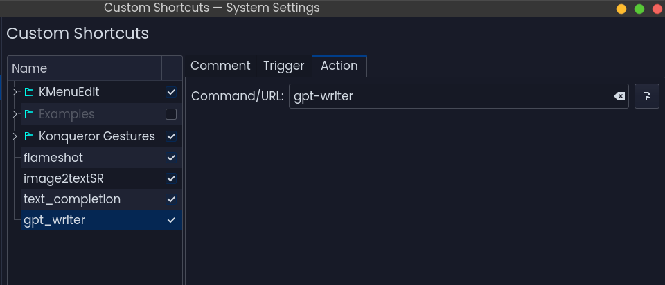

Get API key from Gemini and set it in the `config` file or do it after the installation has been done. Your choice.
Get your gemini api key from https://aistudio.google.com/app/apikey


```bash
cd
rm -r GPT-Writer
git clone https://github.com/SR-Hossain/GPT-Writer.git
cd GPT-Writer
pip install -r requirements.txt
chmod +x gpt-writer
sudo cp gpt-writer /usr/bin
gpt-writer --help
gpt-writer --config
echo "Create custom command shortcut `gpt-writer` from settings"
```




# for commands and help
```bash
gpt-writer --help
```


# update the program to the latest version
```bash
gpt-writer --update
```

